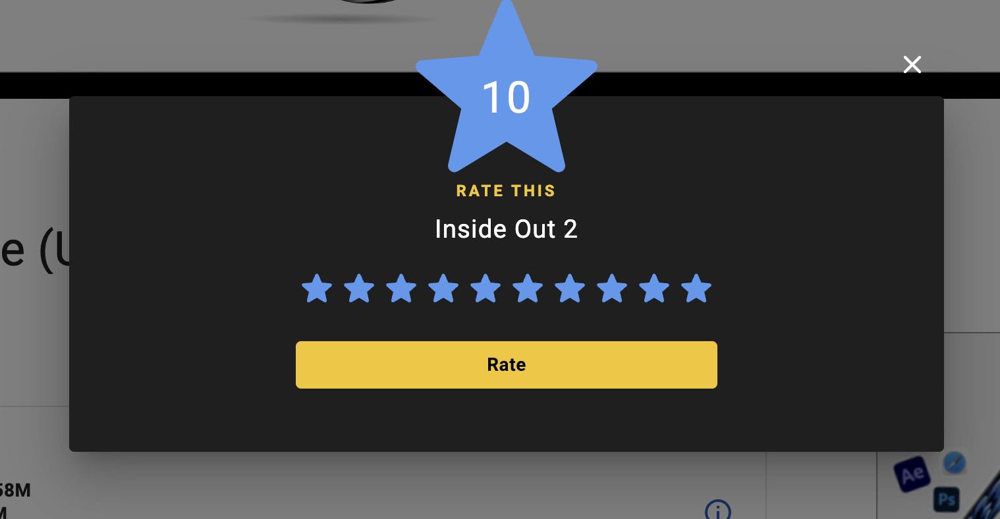

# Bug Report: Rate Button Not Enabled for 10-Star Rating (Top Box Office Test)

| Project: Imdb | Component: Top Box Office |
|Issue Type: Bug|Tester: Terese Emel|
| Reported Date: 2024-07-07| Assigned To: Developer1 |
| Severity: Medium | Priority: High |
| Browsers : Chrome,Firefox| Devices : Mac, Windows |

## Summary:

The "Rate" button on the Top Box Office page is not enabled when a user selects a 10-star rating for a movie. This prevents users from submitting their rating.

## Steps to Reproduce:

1. Goto Imdb.com website
2. Visit the Top Box Office page.
3. Select a movie to rate.
4. Click on the star rating to select 10 stars (the highest rating).
5. Observe that the "Rate" button remains disabled.

### Expected Result:

When a user selects a star rating (including 10 stars), the "Rate" button should become enabled, allowing them to submit their rating.

### Actual Result:

The "Rate" button only becomes enabled when a user selects a rating below 10 stars. It remains disabled when 10 stars are selected.

### Additional Information:

- Include any screenshots or video recordings that demonstrate the issue.(sample screen shots : )
- Provide any relevant code snippets or error messages (if applicable).
